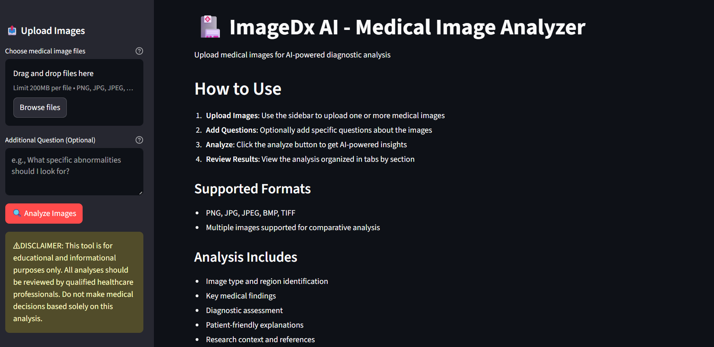

# ImageDx AI - Medical Image Analyzer

An AI-powered medical imaging analysis tool that provides comprehensive diagnostic insights using advanced computer vision and radiological expertise.



## Features

- **Multi-Modal Analysis**: Support for various medical imaging formats (X-ray, MRI, CT, Ultrasound)
- **Comprehensive Reporting**: Structured analysis with 5 key sections
- **User-Friendly Interface**: Clean Streamlit web application
- **Multiple Image Support**: Analyze single or multiple images simultaneously
- **Research Integration**: Automated medical literature search using Tavily
- **Patient-Friendly Explanations**: Clear, jargon-free explanations

## Workflow


## System Architecture

The system consists of three main components:

1. **Image Processing Module** (`imagedx_agent.py`): Handles image encoding and processing
2. **ImageDx AI Agent**: LangGraph-powered agent using Google's Gemini 2.5 Flash model with specialized medical imaging expertise and Tavily search integration
3. **Web Interface** (`streamlit_app.py`): Interactive Streamlit application

### ImageDx AI Agent Details

The core ImageDx AI Agent (`imagedx_agent.py`) combines:

- **Medical Expertise**: Specialized prompts for radiological analysis
- **Multi-modal Processing**: Handles text queries with image inputs
- **Research Integration**: Automated medical literature search via Tavily
- **Structured Output**: Generates consistent 5-section diagnostic reports
- **LangGraph Framework**: Reactive agent architecture for tool integration

## Installation

### Prerequisites

- Python 3.8+
- Google Gemini API key
- Tavily API key

### Setup

1. **Clone the repository**:
   ```bash
   git clone <repository-url>
   cd image-dx-ai
   ```

2. **Install dependencies**:
   ```bash
   pip install -r requirements.txt
   ```

   Or using uv:
   ```bash
   uv sync
   ```

3. **Environment Setup**:
   Create a `.env` file in the project root:
   ```env
   GOOGLE_API_KEY=your_google_gemini_api_key
   TAVILY_API_KEY=your_tavily_api_key
   ```

4. **Run the application**:
   ```bash
   streamlit run streamlit_app.py
   ```

## Usage

### Web Application

1. **Upload Images**: Use the sidebar to upload one or more medical images
2. **Add Questions**: Optionally specify particular areas of interest
3. **Analyze**: Click the "Analyze Images" button
4. **Review Results**: View structured analysis across five tabs:
   - 🔍 **Image Type & Region**: Imaging modality and anatomical details
   - 📋 **Key Findings**: Primary observations and abnormalities
   - ⚕️ **Diagnostic Assessment**: Primary and differential diagnoses
   - 👤 **Patient Explanation**: Simple, clear explanations
   - 📚 **Research Context**: Relevant medical literature and references

### Programmatic Usage

```python
from imagedx_agent import analyze_medical_images

# Single image analysis
result = analyze_medical_images("path/to/xray.jpg", "What abnormalities do you see?")

# Multiple images analysis
result = analyze_medical_images(
    ["scan1.jpg", "scan2.jpg"],
    "Compare these two scans for progression."
)

print(result)
```

## Analysis Output Structure

The AI provides structured analysis in five key sections:

### 1. Image Type & Region
- Imaging modality identification
- Anatomical region and positioning
- Image quality assessment

### 2. Key Findings
- Systematic observations
- Abnormality descriptions with measurements
- Location, size, shape characteristics
- Severity ratings (Normal/Mild/Moderate/Severe)

### 3. Diagnostic Assessment
- Primary diagnosis with confidence level
- Differential diagnoses ranked by likelihood
- Supporting evidence from imaging
- Critical/urgent findings highlighted

### 4. Patient-Friendly Explanation
- Clear, jargon-free language
- Visual analogies when helpful
- Common patient concerns addressed

### 5. Research Context
- Recent medical literature
- Standard treatment protocols
- Relevant technological advances
- Key medical references

## Project Structure

```
image-dx-ai/
├── imagedx_agent.py          # Core AI agent and image processing
├── streamlit_app.py          # Web application interface
├── utils.py                  # Utility functions
├── pyproject.toml           # Project configuration
├── uv.lock                  # Dependency lock file
├── .env.example             # Environment variables template
├── resources/               # Images and assets
│   ├── workflow.png         # System workflow diagram
│   └── screen.png           # Application screenshot
└── README.md               # This file
```

## Important Disclaimers

⚠️ **MEDICAL DISCLAIMER**: This tool is for educational and informational purposes only. All analyses should be reviewed by qualified healthcare professionals. Do not make medical decisions based solely on this analysis.

## API Keys Required

1. **Google Gemini API**: Get from [Google AI Studio](https://makersuite.google.com/app/apikey)
2. **Tavily Search API**: Get from [Tavily](https://tavily.com/)


**Note**: This is a prototype for educational purposes. Always consult qualified healthcare professionals for medical decisions.